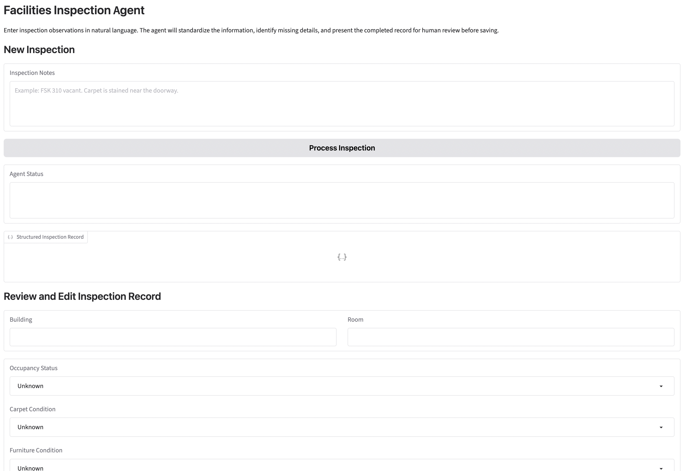
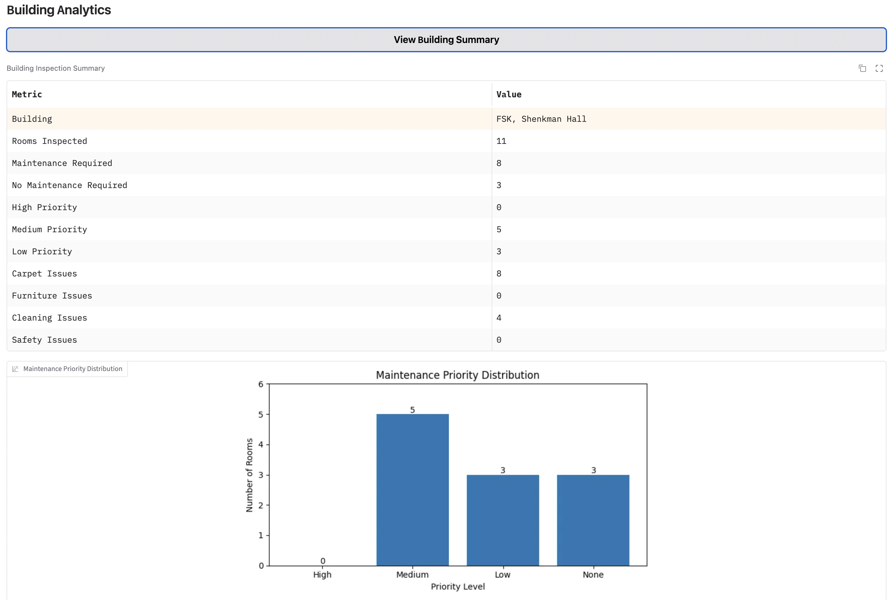
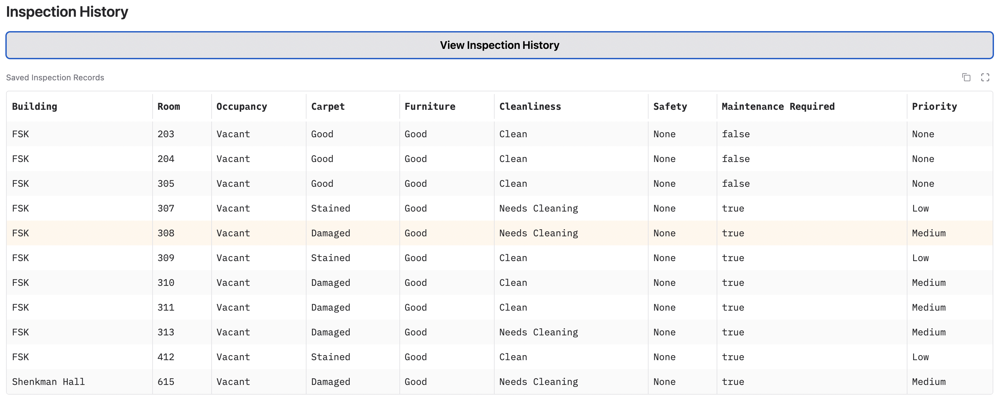
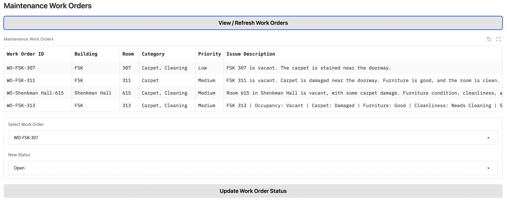
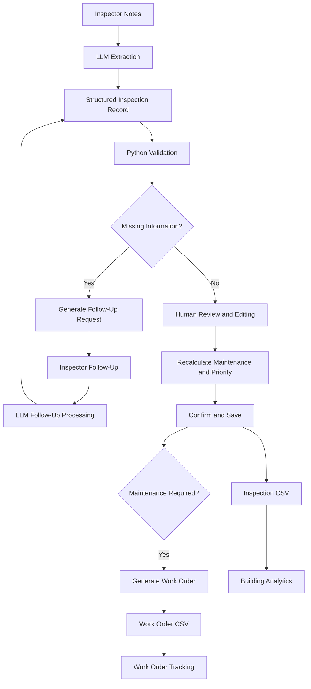

# Facilities Inspection Agent

An LLM-powered facilities inspection workflow designed to reduce repetitive documentation and improve consistency in facilities inspection records.

The application converts natural-language inspection observations into standardized structured records, identifies missing information, supports follow-up interactions, allows human review and correction, generates maintenance work orders, and produces building-level analytics.

## Live Demo

[Try the Facilities Inspection Agent](https://facilities-inspection-agent.onrender.com)

> **Portfolio demo:** Please use synthetic or test information only. Do not enter sensitive or real operational data.

## Why I Built This

This project was inspired by my experience working in facilities services, where inspection documentation can involve repetitive manual data entry and inconsistent descriptions of similar room conditions.

The goal was to explore how an LLM could assist with documentation while keeping operational decisions, validation, and final approval under deterministic rules and human control.

## Core Features

- Natural-language facilities inspection entry
- LLM-powered structured data extraction
- Standardized condition classifications
- Automatic detection of missing inspection information
- Natural-language follow-up workflow
- Human editing of AI-generated records
- Explicit confirmation before saving
- Deterministic maintenance and priority rules
- Duplicate-record protection
- Persistent inspection storage
- Automatic maintenance work-order generation
- Work-order status tracking
- Inspection-history dashboard
- Building-level analytics and visualizations

## Example Workflow

An inspector enters:

> FSK 307 vacant. Carpet is stained near the doorway.

The agent extracts:

- Building: FSK
- Room: 307
- Occupancy: Vacant
- Carpet: Stained
- Furniture: Unknown
- Cleanliness: Unknown
- Safety: Unknown

The system identifies the missing fields and requests additional information.

The inspector responds:

> Furniture is in good condition. The room needs cleaning. No safety concerns.

The record is updated:

- Furniture: Good
- Cleanliness: Needs Cleaning
- Safety: None
- Maintenance Required: True
- Priority: Low

The inspector then reviews the structured record, makes any necessary corrections, and confirms it before saving.

If maintenance is required, the system generates a corresponding work order.

## Screenshots

### Inspection Workflow

### Building Analytics Dashboard

### Inspection History

### Maintenance Work Orders

## System Architecture

## Development Process

The repository includes a separate development notebook documenting the iterative construction of the agent.

The development notebook contains:
- Early LLM extraction experiments
- Prompt-engineering iterations
- Structured-output testing
- Development and holdout evaluations
- Error analysis
- Safety-classification refinement
- Progressive addition of follow-up workflows, human review, persistent storage, analytics, and maintenance work orders

For the clean, runnable version of the application, see `Facilities_Inspection_Agent_Final.ipynb`.

The development notebook is available in the `development/` folder for readers interested in the experimentation and design process.
